# Tory Adventure

Tory Adventure is a collection of interactive farm-themed mini-games developed with Unity. The project combines educational activities, farming, racing, painting, cooking, vehicle repair, obstacle challenges, and animal care into a single interactive experience.

## Game Pictures

  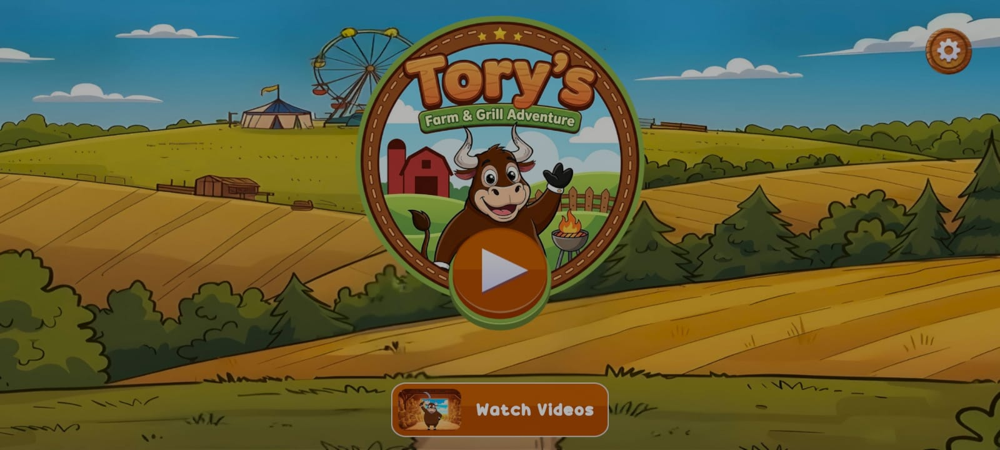
  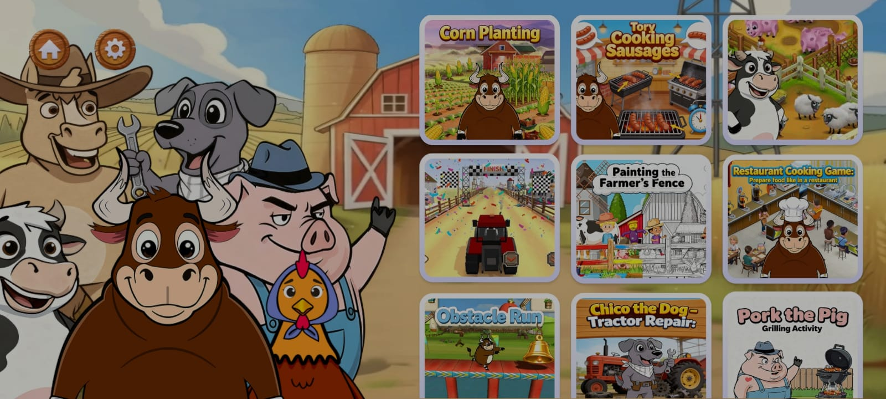
  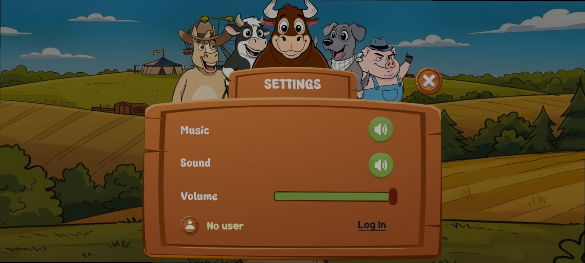
  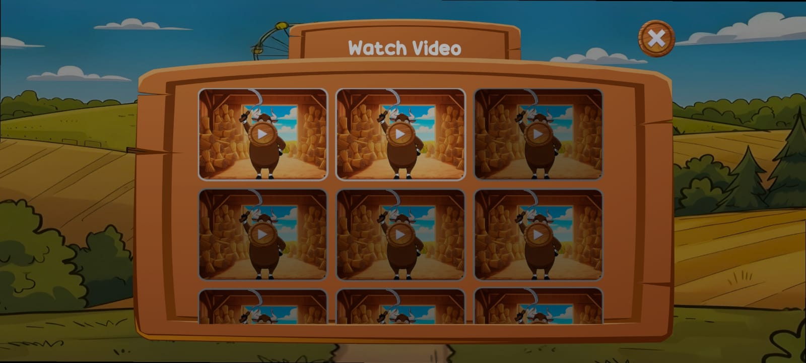
  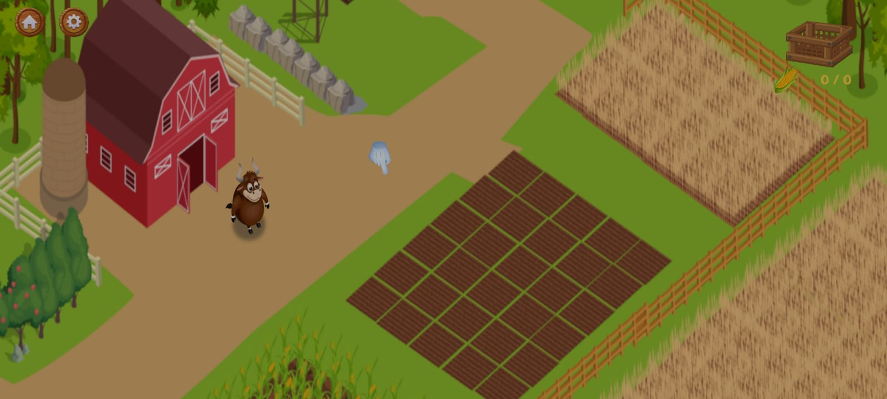

  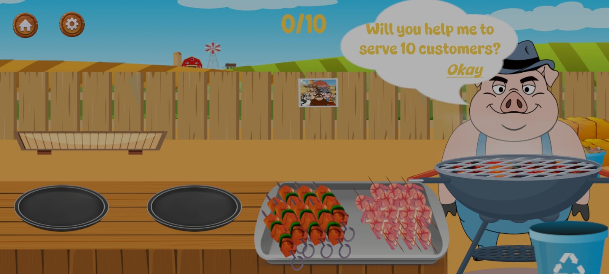
  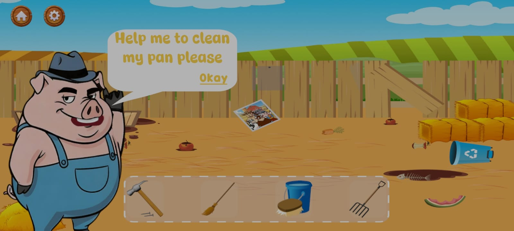
  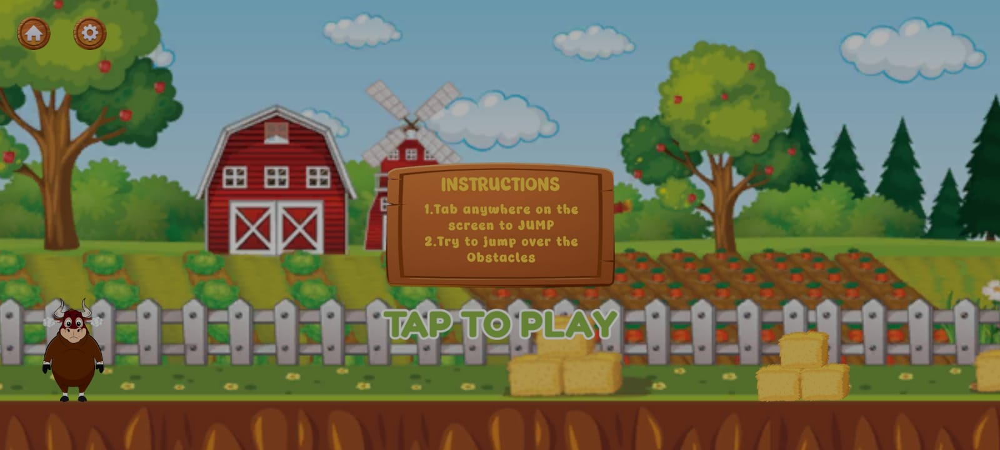
  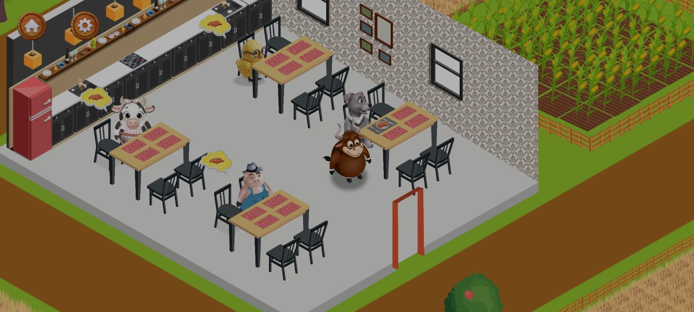
  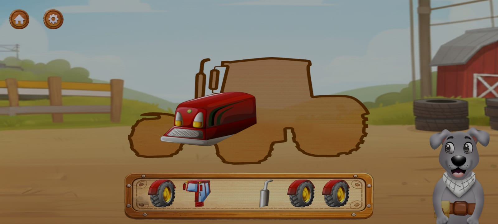

  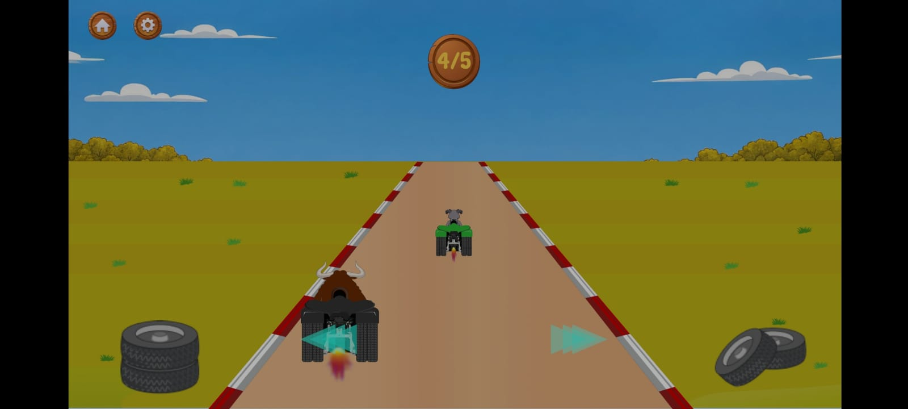
  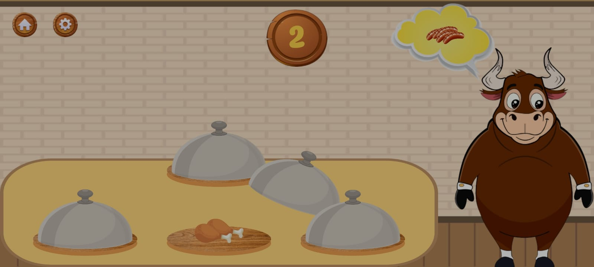
  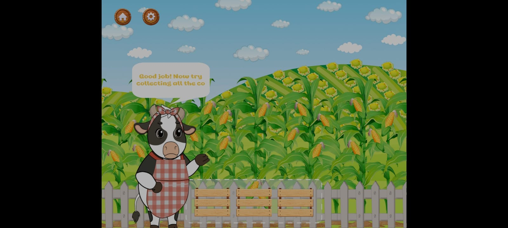
  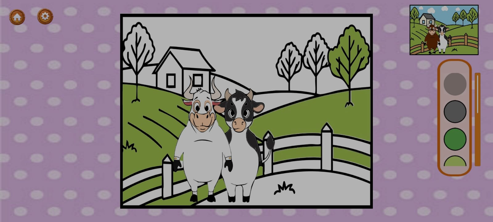
  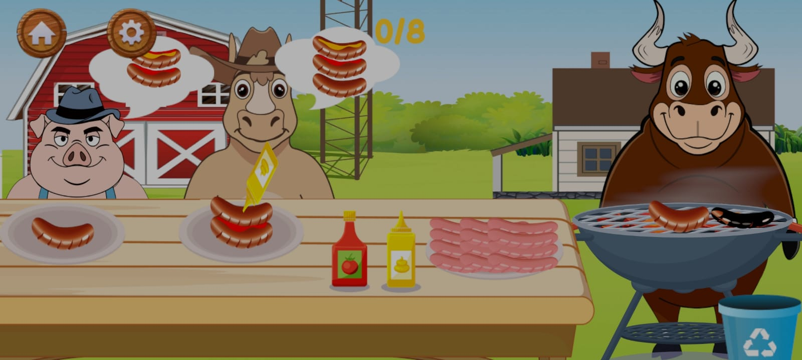

## Game System

- Central game and menu management
- Multiple independent mini-game activities
- Player login and authentication
- Farming and corn planting system
- Painting and creative activity
- Obstacle running system
- Racing game system
- Truck repair activity
- Restaurant and cooking activities
- Pig care and cleaning activities
- Sausage preparation activity
- Sound and audio management
- Interactive UI management
- Used scriptable object 

## Key Features

- 10 plus interactive mini games
- Educational and activity-based gameplay
- Modular mini game architecture
- Interactive farming mechanics
- Racing and obstacle gameplay
- Vehicle repair interactions
- Restaurant and cooking gameplay
- Painting and creative gameplay
- Animal care activities
- Player authentication
- Interactive UI and animations

## Technology

Unity, C#, PlayFab, TextMeshPro, Unity UI, Unity Animation System
